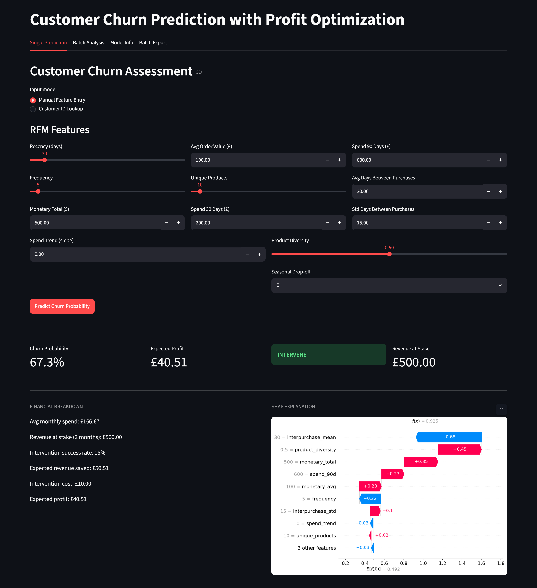
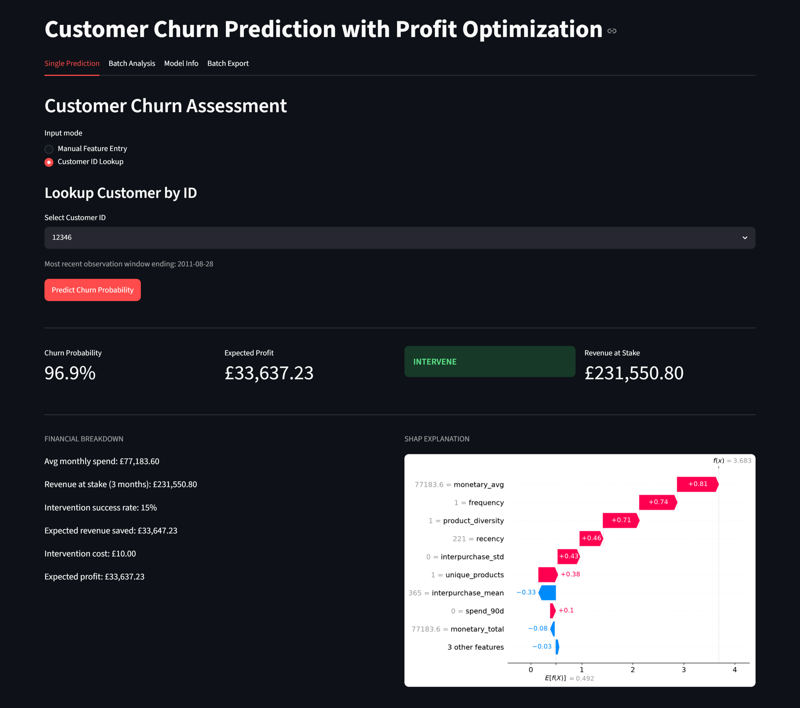
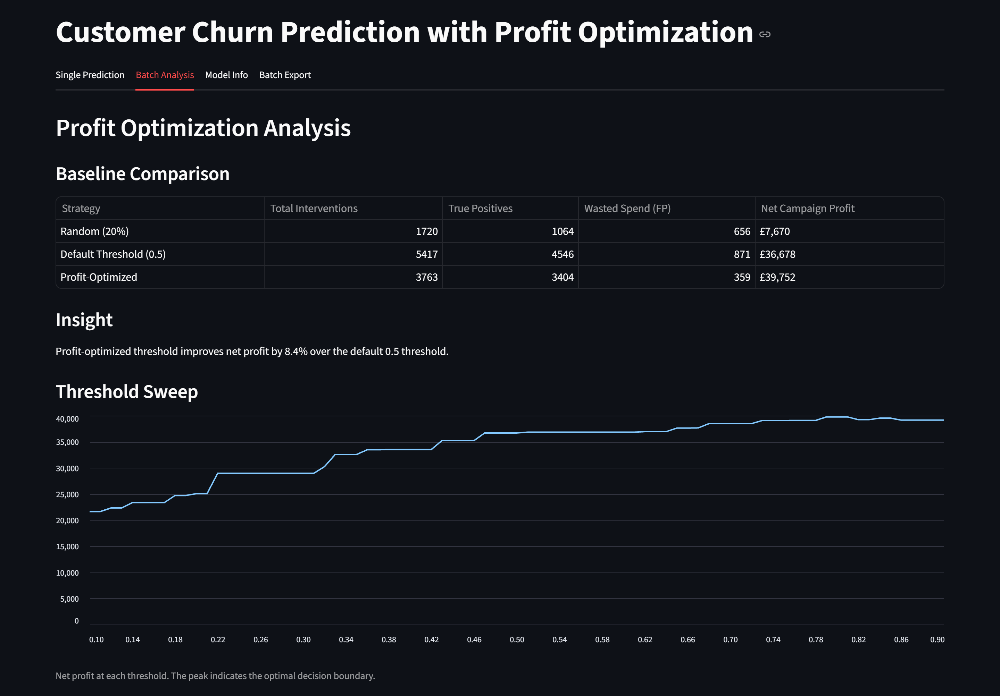
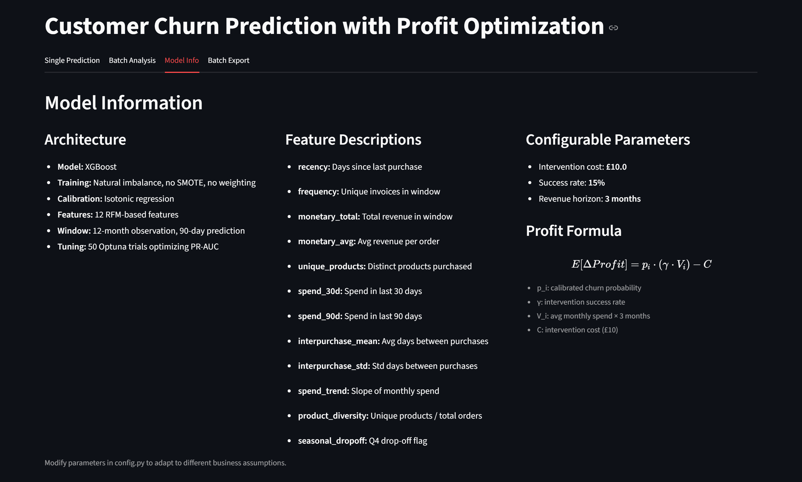
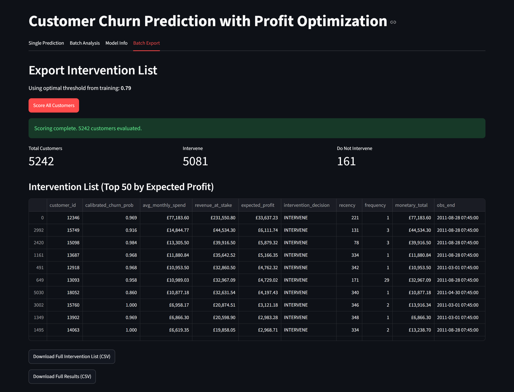

# Customer Churn Prediction with Profit Optimization

Predicting customer churn for non-contractual e-commerce using RFM features, calibrated XGBoost probabilities, and a cost-sensitive decision threshold that maximizes net campaign profit.

## Problem Statement

Standard classification metrics assume false positives and false negatives carry equal cost. In churn intervention, offering a retention discount to a customer who would have stayed anyway burns budget. Failing to catch a churning customer loses revenue. Maximizing ROC-AUC or F1 ignores this asymmetry.

This project replaces default 0.5 thresholding with an expected-value framework: the optimal threshold is the one that maximizes net profit after accounting for intervention cost, retention offer success rate, and the revenue at stake. Every customer receives an "INTERVENE" or "DO NOT INTERVENE" recommendation based strictly on whether the expected financial gain exceeds the intervention cost.

## Dashboard Preview

### Single Prediction - Manual Feature Entry
<!-- Replace with screenshot: tab1 manual entry before prediction -->


### Single Prediction - Customer ID Lookup
<!-- Replace with screenshot: tab1 customer ID lookup mode with dropdown and results -->


### Batch Analysis - Profit Comparison
<!-- Replace with screenshot: tab2 showing baseline comparison table, insight, and threshold sweep chart -->


### Model Info
<!-- Replace with screenshot: tab3 three-column layout with architecture, features, and parameters -->


### Batch Export - Intervention List
<!-- Replace with screenshot: tab4 after scoring, showing summary metrics, top 50 table, and download buttons -->


## Architecture

- **Sliding temporal windows** prevent data leakage. A 12-month observation window, 90-day prediction window, and 30-day slide interval generate multiple training examples per customer across different seasonal periods.
- **Unweighted XGBoost** trained on the natural class imbalance preserves the true base churn rate. No SMOTE, no scale_pos_weight.
- **Isotonic regression** calibrates raw model scores into true probabilities, a strict requirement for valid expected-value calculations.
- **Profit optimizer** sweeps thresholds from 0.10 to 0.90, computes expected net profit at each step, and selects the argmax.
- **Batch export** generates a downloadable intervention list for campaign tools, with per-customer financial justification.

## Dataset

[Online Retail II (UCI)](https://archive.ics.uci.edu/dataset/502/online+retail+ii): Approximately 500,000 transactional records from a UK-based online retailer spanning 2009 to 2011.

**Source:** UCI Machine Learning Repository. Direct download in `.xlsx` format containing two sheets (Year 2009-2010 and Year 2010-2011).

## Project Structure

```
churn-profit-opt/
├── config.py                    # All constants, paths, financial parameters
├── requirements.txt
├── .gitignore
├── run_pipeline.py              # End-to-end training and evaluation script
├── src/
│   ├── data/
│   │   ├── cleaner.py           # Missing ID removal, cancellation fuzzy matching
│   │   └── temporal.py          # Sliding window generator
│   ├── features/
│   │   └── rfm_engineer.py      # RFM + extensions computed per window
│   ├── modeling/
│   │   ├── trainer.py           # XGBoost with Optuna hyperparameter tuning
│   │   └── calibrator.py        # Platt scaling / Isotonic regression
│   ├── evaluation/
│   │   ├── metrics.py           # PR-AUC, Brier score
│   │   └── profit_optimizer.py  # Expected value maximization and baselines
├── app/
│   └── app.py                   # Streamlit interactive dashboard
├── data/
│   ├── raw/                     # Place online_retail_II.xlsx here
│   └── processed/               # Generated feature matrices and results
├── models/                      # Serialized model, calibrator, feature names
└── assets/                 # Dashboard assets for README
```

## Setup

**1. Clone and create environment:**
```bash
git clone <repo-url>
cd churn-profit-opt
python -m venv venv
source venv/bin/activate  # or venv\Scripts\activate on Windows
pip install -r requirements.txt
```

**2. Download the dataset:**
Download `online_retail_II.xlsx` from the [UCI repository](https://archive.ics.uci.edu/dataset/502/online+retail+ii) and place it in `data/raw/`.

**3. Run the pipeline:**
```bash
python run_pipeline.py
```
This executes cleaning, window generation, feature engineering, hyperparameter tuning (50 Optuna trials), calibration, and profit optimization. Serialized model artifacts are saved to `models/`. Processed data and comparison results are saved to `data/processed/`.

**4. Launch the dashboard:**
```bash
streamlit run app/app.py
```

## Key Results

The profit-optimized threshold consistently outperforms the default 0.5 cutoff and random targeting:

| Strategy | Total Interventions | True Positives | Wasted Spend (FP) | Net Campaign Profit |
|---|---|---|---|---|
| Random (20%) | 1,720 | 1,064 | 656 | £7,670 |
| Default Threshold (0.5) | 5,481 | 4,594 | 887 | £36,856 |
| **Profit-Optimized** | **3,995** | **3,608** | **387** | **£39,527** |

The optimal threshold (0.76) produces **7.2% higher net profit** than the 0.5 default with **27% fewer interventions**, reducing both operational cost and unnecessary customer contact.

**Evaluation metrics (validation set):**
- PR-AUC: 0.909
- Brier Score: 0.135
- Optimal threshold: 0.76

## Dashboard Features

Four tabs provide a complete analytical and operational interface:

**Single Prediction:**
- Manual RFM feature entry with sliders or customer ID lookup from the processed feature matrix.
- Four-metric summary row: calibrated churn probability, expected profit, INTERVENE/DO NOT INTERVENE recommendation, and revenue at stake.
- Side-by-side financial breakdown and SHAP waterfall plot for compact, no-scroll viewing.
- Financial breakdown shows all components of the expected value calculation explicitly.

**Batch Analysis:**
- Profit comparison table across random, default threshold, and profit-optimized strategies.
- Profit lift percentage relative to default threshold baseline.
- Threshold sweep line chart visualizing net profit across the full threshold range.

**Model Info:**
- Three-column layout: architecture overview, feature descriptions, and configurable parameters.
- Profit formula displayed with LaTeX rendering.
- All information visible without scrolling.

**Batch Export:**
- One-click scoring of all customers using their latest observation window.
- Summary metrics: total customers, intervene count, do not intervene count.
- Top 50 intervention candidates displayed by expected profit.
- Download full intervention list as CSV for campaign tool import.
- Download complete scored dataset for CRM integration or further analysis.

## Expected Value Framework

The profit calculation for each customer:

```
E[Profit] = P(churn) * (intervention_success_rate * avg_monthly_spend * 3 months) - intervention_cost
```

A customer is targeted only when the expected profit is positive. The INTERVENE tag is not based on churn probability alone — it requires the expected financial gain to exceed the intervention cost. A customer with 30% churn probability but low monthly spend will be flagged DO NOT INTERVENE because the expected return is negative. This is the core differentiation from standard threshold-based classification.

## Configurable Parameters

All constants are centralized in `config.py`:

| Parameter | Default | Description |
|---|---|---|
| `OBSERVATION_WINDOW_DAYS` | 365 | Length of observation window |
| `PREDICTION_WINDOW_DAYS` | 90 | Churn lookahead period |
| `SLIDE_INTERVAL_DAYS` | 30 | Step size for sliding windows |
| `COST_OF_OFFER` | 10.0 | Cost per retention intervention (£) |
| `INTERVENTION_SUCCESS_RATE` | 0.15 | Fraction of churners who accept the offer |
| `MONTHS_REVENUE_SAVED` | 3 | Revenue horizon if customer is retained |
| `OPTUNA_TRIALS` | 50 | Number of hyperparameter search trials |
| `CALIBRATION_METHOD` | isotonic | isotonic or platt |

Modify these to adapt the system to different business assumptions without changing pipeline code.

## Key Design Decisions

- **No SMOTE or class weighting:** Preserves true base churn rate for valid probability outputs. Post-hoc calibration corrects any score distortion from imbalance.
- **Isotonic over Platt scaling:** Non-parametric calibration handles the non-logistic score distortion typical of XGBoost on imbalanced data.
- **90-day churn window:** Balances false positive reduction against timely intervention. 30 days is too noisy; 180 days is too late.
- **Sliding windows over single split:** Prevents seasonal overfitting. E-commerce has strong Q4 effects that a single snapshot cannot capture.
- **PR-AUC over ROC-AUC:** ROC-AUC inflates performance on imbalanced data by rewarding correct ranking of abundant negatives.
- **Per-customer expected value over aggregate threshold:** The INTERVENE tag uses individual revenue and probability, not a population-level cutoff. This captures heterogeneity in customer value that a single threshold misses.

## Limitations

- Cancellation matching uses fuzzy logic on invoice prefixes. Orphaned partial refunds without a matching valid invoice are dropped.
- The current validation split is random across the concatenated feature matrix, not stratified by customer ID. A customer may appear in both train and validation across different windows.
- The intervention success rate is a configurable constant, not a learned parameter. In production, this would come from A/B testing.
- Cold-start customers with no transaction history cannot be scored.
- The single optimal threshold is computed globally. Segment-specific thresholds per spend tier would capture heterogeneous cost-benefit structures.
- The batch export uses the latest observation window per customer. Customers without a recent window are excluded.